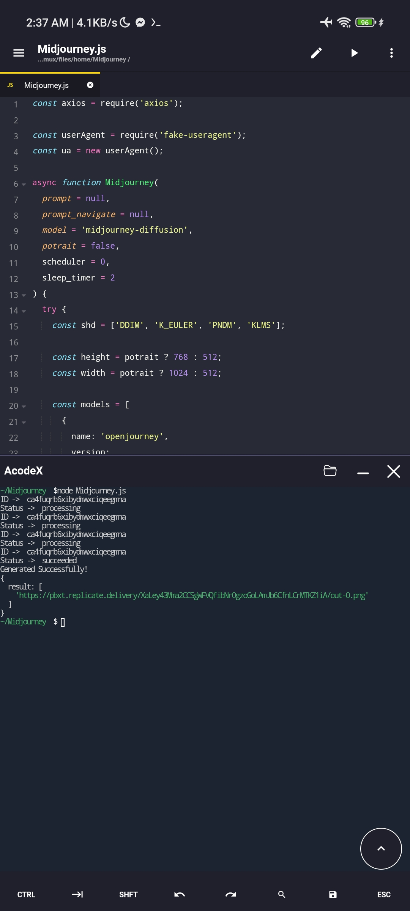

# Midjourney Image Generator
This Node.js script uses the Replicate API to generate images with AI models. Choose from multiple models, customize prompts, and control image properties. A versatile tool for creative exploration.



## Models available for use:
- openjourney
- midjourney-diffusion
- stable-diffusion

## How To Use:
```javascript
const axios = require('axios');

const userAgent = require('fake-useragent');
const ua = new userAgent();

async function Midjourney(
  prompt = null,
  prompt_navigate = null,
  model = 'midjourney-diffusion',
  potrait = false,
  scheduler = 0,
  sleep_timer = 2
) {
  // ... (rest of the code)
}

(async () => {
  console.log(await Midjourney('Mark Zuckerberg kissing Elon Musk'));
})();


